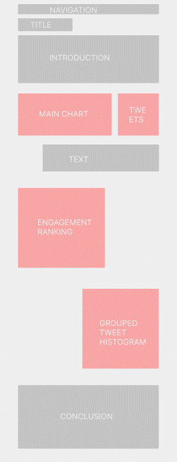
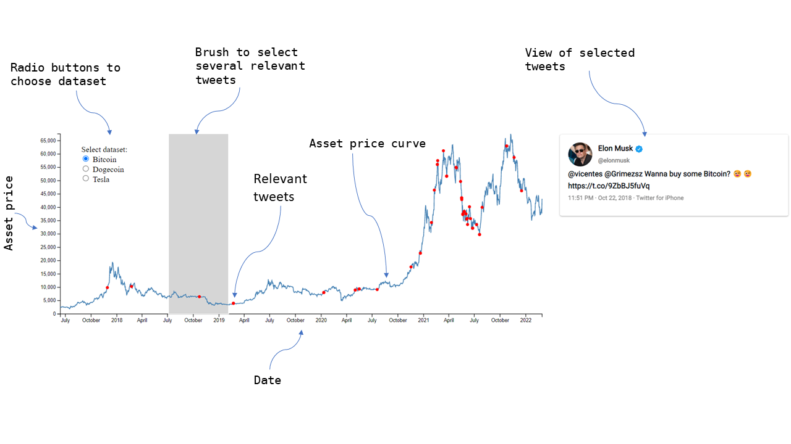
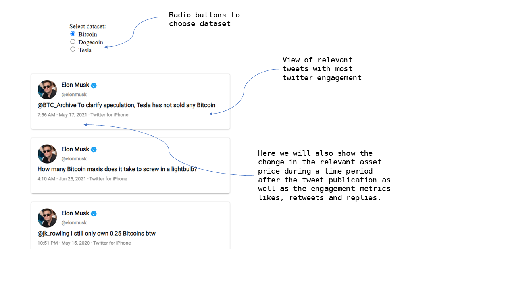

# Project of Data Visualization (COM-480)

| Student's name     | SCIPER |
| ------------------ | ------ |
| Albert Aillet      | 350968 |
| Alexander Brokking | 350973 |
| Shrirang Bagdi     | 350699 |

[Milestone 1](#milestone-1-friday-8th-april-5pm) •
[Milestone 2](#milestone-2-friday-6th-may-5pm) •
[Milestone 3](#milestone-3-friday-3rd-june-5pm)

## Milestone 1 (Friday 8th April, 5pm)

**10% of the final grade**

### Dataset

- **Kaggle**: ([link](https://www.kaggle.com/ayhmrba/elon-musk-tweets-2010-2021?select=2021.csv))

Elon Musk tweets 2011-2021 (March)

- **Twitter API**: ([link](https://developer.twitter.com/en/docs/twitter-api))

Elon Musk tweets, Twitter dev API (March 2021 - Current)

- **Yahoo Finance API**: ([link](https://pypi.org/project/yfinance/))

Cryptocurrencies 2010-Current
Tesla stock 2010-Current

#### Description

Three main data sources for creating the visualization datasets were identified: Yahoo Finance, Kaggle and the Twitter developer API.

Yahoo Finance provides an easy to use API for fetching high quality asset price data over a predetermined sample period. It will allow us to collect crypto and stock data in the same format and over the same period. Thus, very little preprocessing will be required to combine them for visualization.

To create the Elon Musk tweet data set, two seperate data sources will have to be leveraged. Firstly, a public domain dataset available on kaggle provides historical tweets between 2011 and March 2021. However, to analyze his more recent tweets, additional tweets will be collected through the twitter developer api and then be used to enhance the original tweet dataset. This requires interfacing with Twitter’s developer api and some data preprocessing to make the datasets compatible. Specifically, columns have to be processed into the same format and any dataset overlap has to be removed. Because there is a limit to how far back into the history tweets can be retrieved using the standard Twitter developer account, the full dataset cannot be created through the Twitter API. Ultimately, the data we are utilizing is of good quality as we are able to use the data as it is for its intended use.

### Problematic

Elon Musk is a highly public persona and cultural phenomena of the twenty-first century. As one of the world’s richest individuals, Elon Musk has founded several incredibly successful companies including PayPal, the Boring Company, Tesla, and SpaceX.

With Elon Musk’s influence and large cultural following including almost 80M Twitter followers, many of the things he tweets about can have far reaching effects. In recent years, Elon Musk has received criticism and come under scrutiny from media and regulators accusing him of market manipulation of stocks and cryptocurrencies
[[1](https://www.washingtonpost.com/opinions/2021/05/26/elon-musk-tweets-crypto-markets/)]
[[2](https://www.cnbc.com/2021/01/29/elon-musks-tweets-are-moving-markets.html)]. On september 27th 2018 he was for example charged by the Securities and Exchange Commission with securities fraud for a series of false and misleading tweets about a potential transaction to take Tesla private
[[3](https://www.sec.gov/news/press-release/2018-219)].

In the last days as of writing it has been brought to light that Elon Musk is Twitter's largest shareholder as he owns 9.2% of Twitter [[4](https://www.ft.com/content/29b9c884-02d7-4d1c-a4ab-c862242fa76e)]. As a result of information about Musks ownership made public, Twitter shares have surged about 26% in premarket trading [[5](https://time.com/6164223/elon-musk-twitter-stake/)] showing once again how Elon Musk has influence on the stock market.

Our visualization aims to illustrate the impact Elon Musk's tweets have on the stock and cryptocurrency markets. The visualizations seek to empower people who want to investigate Elon Musk’s potential market influence including future investors who desire to understand the different trends that affect the market. If an influence could be established, it would underline the importance of conducting research and understanding the news and and public figures have put out before investing.

### Exploratory Data Analysis

See [this notebook](exploration/data_exploration.ipynb). Information about both the collected tweets and the asset price data are presented using plotly graphs.

The data exploration was inspired by the below mentioned Kaggle notebook as well as **Exploring Elon Musk Tweets** (Kaggle user Aleksey Bilogur, [link](https://www.kaggle.com/code/residentmario/exploring-elon-musk-tweets))

To get interactive plotly graphs run the notebook locally (or possibly online using for example [nbviewer](https://nbviewer.org/), [Binder](https://mybinder.org/) or [Colab](https://colab.research.google.com/)) and comment out the following code in the first cell.

From:

```python
pio.renderers.default = "png"
```

To:

```python
# pio.renderers.default = "png"
```

### Related work

There are multiple recent examples on Kaggle where users have created notebooks analyzing Elon Musk’s tweets impact on the Dogecoin crypto prices.
The ones we were able to find are linked here:

1. **Elon Musk Crypto Analysis** (Kaggle user Steven Slater, March 2022, [link](https://www.kaggle.com/code/stevenslater/elon-musk-crypto-analysis))
2. **Dogecoin📀 and DogeFather (Elon Musk)🧑🏻‍🚀** (Kaggle user Youngjin Choin, August 2021, [link](https://www.kaggle.com/code/hidelloon/dogecoin-and-dogefather-elon-musk))
3. **💰Bitcoin/Dogecoin on RAPIDS and Elon Musk** (Kaggle user Andrada Olteanu, March 2021, [link](https://www.kaggle.com/code/andradaolteanu/bitcoin-dogecoin-on-rapids-and-elon-musk))

_Elon Musk Crypto Analysis_ focuses on the trading returns using a strategy consisting of investing when Elon Musk references the crypto currency in a tweet. It also includes sentiment analysis of the tweets, but the Kaggle user concludes them as unsatisfactory. _Dogecoin📀 and DogeFather (Elon Musk)🧑🏻‍🚀_ puts greater emphasis on Elon Musk’s potential Twitter impact on the Dogecoin asset price and identifies a set of tweets that could have been highly influential.

Neither of the notebooks create any interactive visualizations that allow the user to idiosyncratically investigate the data. Moreover, the data is limited to the period up to March 2021 and mostly focuses on the Dogecoin cryptocurrency. It would therefore be interesting to expand these analyses with more recent data and apply them to additional assets.

We were inspired by the analyses we found on Kaggle, especially those mentioned above.

An unrelated source of inspiration for our visualizations are the some of the OPENAI blog pages that have a beautiful presentation and clean graphs.
Some examples are the
<a href="https://openai.com/blog/clip/#probe-chart" title = "Chart of model efficiency">CLIP blog</a>,
<a href="https://openai.com/blog/image-gpt/#chart-val" title = "Generative performance graph">Image GPT blog</a> and
<a href="https://openai.com/blog/better-language-models/" title = "GPT blog page presentation">GPT blog</a>.

We have also been inspired by visualizations from the [Visual Capitalist](visualcapitalist.com) website, for example the following ones.

<p float="left">


</p>

## Milestone 2 (Friday 6th May, 5pm)

**10% of the final grade**

### Sketches of our visualizations
<table>
  <tr>
    <td valign="top" width="40%"></td>
    <td valign="top">
To explore Elon Musk’s twitter impact on the stock and cryptocurrency markets, three main visualizations aim to be presented on our website. Between them there will be interludes with introductory texts and interesting takeaways.

Our current thinking is that this application will be a single page react app where navigation will either scroll the user down to the relevant part of the app or re-route the user to a page with an excerpt containing the specific visualization.

The tools we expect to need to accomplish this visualization are the following:

- Vite (Javascript frontend tooling).
- D3 (JavaScript library for producing dynamic, interactive data visualizations).
- React (JavaScript library for building user interfaces based on UI components).
- Three.js (potentially) (JavaScript library interface used to create and display animated 3D computer graphics).
</td>
  </tr>
</table>
<p float="center">

</p>

Visualization 1. Main chart visualization and selected tweets. This will be the most important visualization on our website. It is an interactive chart where you can see how different tweets correlate with asset price changes.

<p float="center">

</p>

Visualization 2. Engagement ranking. This will be a sorted ranking of how tweets relevant to the different datasets can be ordered in terms of engagement. It will help to illustrate if the most engaging tweets have a bigger impact on asset prices.

### Theory concepts used:

The concepts from the lectures we make use of in our visualization are the following:

- Brushing (from the Interaction lecture): The plot uses brushing to choose the period from which we want to view tweets, which makes it possible for the user to choose which part of the data they want to view.

- Linking (from the Interaction lecture): We link the plot of the asset price and the view of the tweets together as the tweets that are selected on the main plot are then shown in detail in the text box.

- Filtering (from the Interaction lecture): We filter part of the dataset to the tweets that are relevant to the asset we want to view.

- Layering (from the Interaction lecture): We view both the time of the tweets and the asset price data at the same time to should they relationship.

- In out main visualization we start the price chart at zero and try to show the whole context (from the Do and don'ts lecture).

- We think we strive for the most simple view of the data and have not useless visual elements that detract from the message. (from the Do and don'ts lecture)

- We aim to use the described concepts regarding choosing related colors for sequential and divergent data. Moreover, we aim to use the theory of visual popout to illustrate significant features and principles of grouping to visually organize our content. (from the Color Perception lecture)

### More advanced ideas

We have also considered a few more advanced ideas that may be implemented if there is time available:
- Enable switching between darkmode / lightmode.
- Loading Screen when loading the datasets.
- Automatically update tweet and price datasets as we have access to the twitter and yahoo finance APIs.
- Advanced scroll animations and dataset transitions.
- Accessibility focus, where you can listen to the texts. Potentially use AI to interpret the graphs and text-to-speech to read them.
- Use three.js to 3D animate features that improve storytelling.

### Initial website

The initial website with the basic
skeleton of the visualization is available at this [link](https://viz-clowns.netlify.app/).

## Milestone 3 (Friday 3rd June, 5pm)

**80% of the final grade**

## Late policy

- < 24h: 80% of the grade for the milestone
- < 48h: 70% of the grade for the milestone
